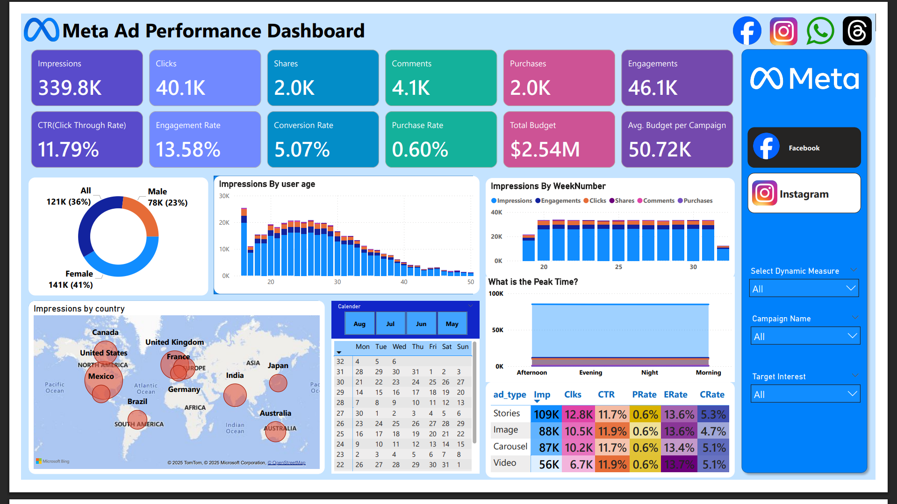

# Meta-Ad-Performance-Analysis
A comprehensive performance dashboard for Meta (Facebook &amp; Instagram) ads, offering a full-funnel view from impressions to conversions. It helps the marketing team gain insights, optimize budgets, and identify effective platforms and audience engagement trends.

# Meta (Facebook & Instagram) Ad Performance Analysis

## 📊 Project Overview

This project presents a comprehensive performance analysis dashboard for Meta (Facebook & Instagram) advertising campaigns. The dashboard provides a full-funnel view, tracking key metrics from initial ad impressions to final conversions (purchases). The goal is to empower the marketing team with actionable insights to identify effective platforms, optimize budget allocation, and understand audience engagement patterns.

This repository includes:

  * **Power BI Files**: The `.pbix` and `.pbit` files for the interactive dashboard.
  * **Source Documents**: The Business Requirements Document (BRD), Domain Knowledge Document, and final insights summary.
  * **Dashboard Export**: A PDF version of the final report.

## 🎯 Business Objective

The primary objective is to create a robust performance tracking report that offers clear visibility into campaign reach, engagement, conversions, and budget utilization. This enables data-driven decision-making to maximize Return on Investment (ROI).

### Key Questions to Answer:

1.  Which platform (Facebook vs. Instagram) is more effective?
2.  What is the campaign's ROI and how can budget allocation be optimized?
3.  What are the audience's engagement patterns (demographics, geography, time of day)?
4.  Which ad formats (Video, Image, Stories, Carousel) perform best?

## 🛠️ Tools Used

  * **Power BI**: For data modeling, analysis, and dashboard creation.
  * **DAX (Data Analysis Expressions)**: For creating custom measures and KPIs.

## 📈 Key Performance Indicators (KPIs)

The dashboard tracks the following core metrics:

| KPI               | Definition                                      | Formula                             | Purpose                        |
| ----------------- | ----------------------------------------------- | ----------------------------------- | ------------------------------ |
| **Impressions** | Number of times ads were displayed.             | `Count of event_type = Impression`  | Measure campaign reach         |
| **Clicks** | Number of times users clicked on ads.           | `Count of event_type = Click`       | Measure engagement intent      |
| **Purchases** | Number of user conversions/purchases.           | `Count of event_type = Purchase`    | Measure conversion success     |
| **CTR** | Click-Through Rate (`Clicks / Impressions`).    | `[Clicks] / [Impressions]`          | Measure ad creative effectiveness |
| **Conversion Rate** | Percentage of clicks that resulted in a purchase. | `[Purchases] / [Clicks]`            | Measure funnel efficiency      |
| **Purchase Rate** | Percentage of impressions that led to a purchase. | `[Purchases] / [Impressions]`       | Measure overall ad impact      |
| **Engagement Rate** | Rate of user interactions relative to reach.    | `(Clicks+Shares+Comments) / Impressions` | Measure content resonance      |

## 🗂️ Data Model

The dataset consists of four interconnected tables that model a typical ad platform's data structure:

1.  **`ad_events`**: The primary fact table containing logs of all user interactions (impressions, clicks, shares, comments, purchases) with a timestamp.
2.  **`ads`**: A dimension table with details about each ad creative, including ad type (Video, Image), platform, and targeting criteria.
3.  **`campaigns`**: A dimension table holding high-level information about each campaign, such as name, budget, and duration.
4.  **`users`**: A dimension table containing demographic and geographic data about the users who interact with the ads.

The tables are related as follows:

  * `ad_events` → `ads` (Many-to-One)
  * `ads` → `campaigns` (Many-to-One)
  * `ad_events` → `users` (Many-to-One)

## ✨ Dashboard Features & Visualizations

The dashboard is designed to provide insights at a glance, with dynamic filtering capabilities.

  * **KPI Cards**: At-a-glance view of primary metrics like Impressions, Clicks, Purchases, CTR, and Total Budget.
  * **Demographic Analysis**: Bar charts breaking down performance by user gender and age group to identify the most responsive audience segments.
  * **Geographic Map**: A world map visualizing performance by country, highlighting key markets.
  * **Calendar Heatmap**: Shows performance at a monthly level to detect seasonal trends and peak advertising periods.
  * **Weekly & Hourly Trends**: Stacked column and area charts reveal performance patterns by week and hour of the day, helping to optimize ad scheduling.
  * **Ad Type Matrix**: A detailed table comparing the performance of different ad formats (Video, Stories, Image, Carousel) side-by-side.

## 💡 Key Insights & Recommendations

### Insights

1.  **Strong Top-Funnel, Weak Bottom-Funnel**: The ads excel at generating awareness and engagement, evidenced by a high **Click-Through Rate (11.76%)** and **Engagement Rate (13.56%)**. However, the **Purchase Rate (0.61%)** is low, indicating a significant drop-off in the conversion funnel.
2.  **Core Audience Identified**: The primary audience consists of **Females aged 18-30**, with the highest engagement coming from **India** and **Brazil**.
3.  **Top Performing Ad Formats**: **Video** and **Stories** ads consistently outperform Image and Carousel ads, delivering the highest CTR, Conversion Rate, and Engagement Rate.
4.  **Peak Engagement Times**: User activity and engagement peak during the **afternoon and evening hours**.
5.  **Geographic Performance**: While **India and Brazil** drive the highest volume of impressions and clicks, countries like **Germany and the UK** show higher conversion value, indicating a more qualified audience.

### Recommendations

1.  **Optimize the Conversion Funnel**: Focus on improving the post-click experience. A/B test landing pages, refine product offers, and implement retargeting campaigns to capture users who engaged but did not purchase.
2.  **Refine Audience Targeting**: Double down on the core demographic. Create tailored campaigns specifically for young females (18-30) in high-engagement countries like India and Brazil.
3.  **Reallocate Budget**: Shift a larger portion of the advertising budget towards **Video and Story ads** to maximize ROI.
4.  **Optimize Ad Scheduling**: Schedule ad delivery to align with peak user activity in the **afternoon and evening** to increase visibility and engagement.
5.  **Implement Segmented Geographic Strategies**: Develop separate campaign strategies for volume-based markets (e.g., India) and value-based markets (e.g., Germany) to cater to different user behaviors.

## 🚀 How to Use

1.  Clone the repository.
2.  Open the `Meta Ad performance analysis.pbix` file in Power BI Desktop.
3.  Interact with the filters and slicers to explore the data dynamically.

-----

*This project was created based on the dataset and project brief from the Data Tutorials YT Channel by Swapnjeet S.*
